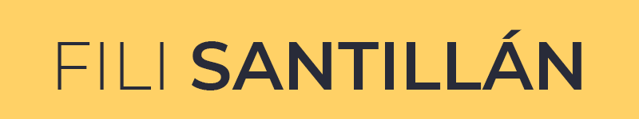
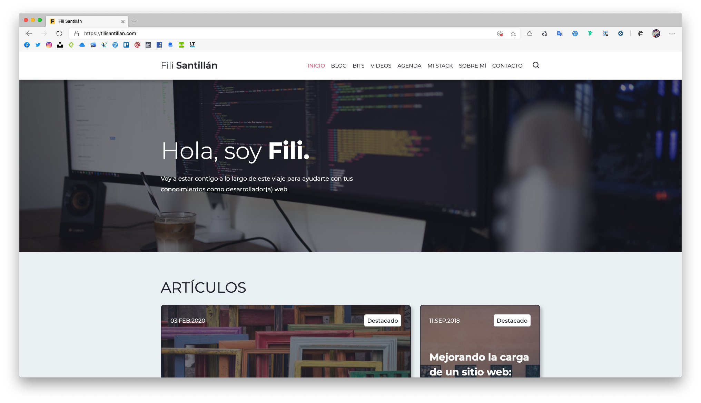

<br/>

<p align="center">
  <a href="https://github.com/FiliSantillan/asynchronism">
    
  </a>

  <h3 align="center">Fili Santillán 4.0.1</h3>

  <p align="center">
    Código fuente de mi sitio web
    <br />
    <br />
    <a href="https://filisantillan.com/" target="_blank" rel="noopener">VER SITIO</a>
    ·
    <a href="https://github.com/FiliSantillan/Blog/issues/new?assignees=FiliSantillan&labels=Bug&template=bug.md">REPORTAR UN BUG</a>
    ·
    <a href="https://github.com/FiliSantillan/Blog/issues/new?assignees=FiliSantillan&labels=Suggestion&template=feature.md">MANDA TU IDEA</a>
  </p>

  <p align="center">
    
  </p>
</p>

<hr />

¡Hola! mi nombre es Filiberto, aunque todos me suelen decir Fili. Desarrollador Frontend desde el 2015. Me encanta aprender y compartir conocimiento. En este repositorio encontrarás todo el código fuente de mi sitio web.

Si quieres usar mi tema para tu blog/proyecto lo puedes hacer sin ningún problema, sería increíble que me lo hagas saber en mis [redes sociales](#%f0%9f%a4%93-aprende-algo-hoy) 🤟.

## 💻 Comandos

Para instalar las dependencias:

```
npm install
```

Para generar los archivos:

```
npm run prod
```

Si necesitas generar un entorno de desarrollo:

```
npm run dev
```

## 📦 Módulos

Actualmente algunos botones, bloques y fragmentos de código tienen que ser puestos manualmente en cada post. Esos módulos son los siguientes:

### Tabla de contenidos

```html
<aside id="table-of-contents" class="table-of-contents">
    <strong class="table-of-contents__title u-disp-block">Contenido</strong>
</aside>
```

### Botones

```html
<div class="resources">
    <a href="#" class="resources__button btn">Soporte</a>
    <a href="#" class="resources__button btn-alternative">Demo</a>
    <a href="#" class="resources__button btn">Github</a>
</div>
```

### Bloques para los posts

```html
<div class="tip">
    <strong class="title">Tip</strong>
    <p class="text">
        Bloque para tips
    </p>
</div>

<div class="note">
    <strong class="title">Nota</strong>
    <p class="text">
        Bloque para notas.
    </p>
</div>

<div class="warning">
    <strong class="title">Advertencia</strong>
    <p class="text">
        Bloque para advertencias.
    </p>
</div>
```

## 🤓 Aprende algo hoy

Instagram: [@fili.santillan](https://www.instagram.com/fili.santillan/)  
Twitter: [@FiliSantillan](https://twitter.com/FiliSantillan)  
Facebook: [Fili Santillán](https://www.facebook.com/FiliSantillan96/)  
Sitio web: http://filisantillan.com

## 🤜 Contribuye

Cualquier contribución es bienvenida, si crees que podrías aportar al código, manda tu PR para cualquier mejora o corrección.

## 📚 Recursos

En el sitio usé unos magníficos iconos con degradados, si te interesan esos iconos y quisieras ver más, lo puedes hacer en la página de [gradientify](https://www.iconshock.com/svg-icons/).

## 📜 Licencia

[MIT](https://github.com/FiliSantillan/Blog/blob/master/LICENSE)
